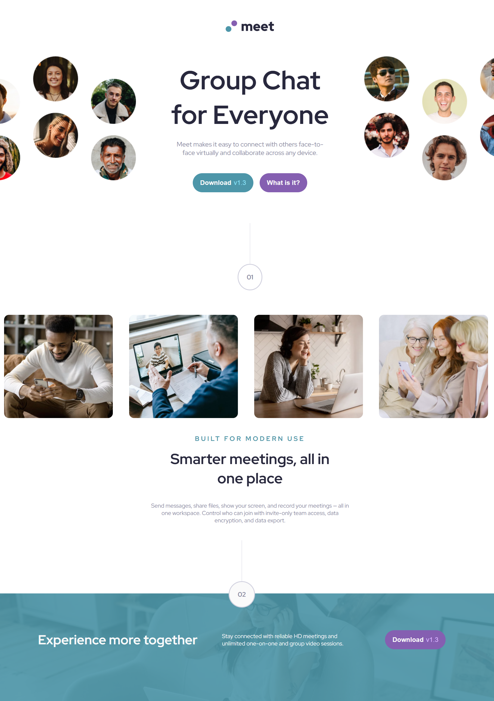

# Frontend Mentor - Meet landing page solution

This is a solution to the [Meet landing page challenge on Frontend Mentor](https://www.frontendmentor.io/challenges/meet-landing-page-rbTDS6OUR). Frontend Mentor challenges help you improve your coding skills by building realistic projects. 

## Table of contents

- [Overview](#overview)
  - [The challenge](#the-challenge)
  - [Screenshot](#screenshot)
- [My process](#my-process)
  - [Built with](#built-with)
  - [What I learned](#what-i-learned)

## Overview

### The challenge

Users should be able to:

- View the optimal layout depending on their device's screen size
- See hover states for interactive elements

### Screenshot

Desktop screenshot

## My process

### Built with

- Semantic HTML5 markup
- CSS custom properties
- Flexbox
- CSS Grid
- Mobile-first workflow

### What I learned

This project allowed me to significantly strengthen my CSS skills, particularly in Flexbox and CSS Grid for building complex, structured layouts. 

It was my first realistic web development project, requiring the creation of a fully responsive landing page optimized for mobile, tablet, and desktop. 

The project also provided an opportunity to apply and consolidate core HTML and CSS fundamentals in a practical, real-world context, reinforcing my understanding of responsive design and layout techniques.
